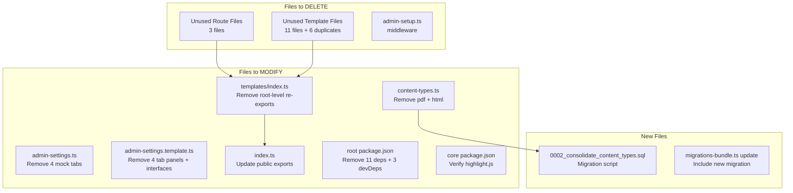

# Solution Design Document

## Validation Checklist

- [x] All required sections are complete
- [x] No [NEEDS CLARIFICATION] markers remain
- [x] All context sources are listed with relevance ratings
- [x] Project commands are discovered from actual project files
- [x] Constraints -> Strategy -> Design -> Implementation path is logical
- [x] Architecture pattern is clearly stated with rationale
- [x] Every component in diagram has directory mapping
- [x] Every interface has specification
- [x] Error handling covers all error types
- [x] Quality requirements are specific and measurable
- [x] Every quality requirement has test coverage
- [ ] **All architecture decisions confirmed by user**
- [x] Component names consistent across diagrams
- [x] A developer could implement from this design

---

## Constraints

CON-1 **Platform**: Cloudflare Workers (D1 SQLite, R2, KV). All code must remain edge-compatible. No Node.js-only APIs.
CON-2 **Framework**: Hono v4 for HTTP routing, Drizzle ORM for database, tsup for build.
CON-3 **Plugin safety**: Files under `plugins/` must not be deleted - they are dynamically loaded and knip cannot trace them.
CON-4 **Data preservation**: Existing content rows with `collectionId = 'pdf'` or `'html'` must remain accessible after migration.
CON-5 **Public API**: Exports from `index.ts` that are part of the public `@warpcms/core` SDK surface must not be broken without a major version bump.

## Implementation Context

### Required Context Sources

- ICO-1 Content type system
  ```yaml
  - file: packages/core/src/content-types.ts
    relevance: HIGH
    why: "Defines the 5 content types to be consolidated to 3"

  - file: packages/core/src/routes/admin-content.ts
    relevance: HIGH
    why: "Imports and uses getContentType/getAllContentTypes - primary consumer"

  - file: packages/core/src/templates/pages/admin-content-form.template.ts
    relevance: MEDIUM
    why: "Imports ContentType/ContentTypeField types for form rendering"
  ```

- ICO-2 Settings system
  ```yaml
  - file: packages/core/src/routes/admin-settings.ts
    relevance: HIGH
    why: "Route handlers for all settings tabs including mock data"

  - file: packages/core/src/templates/pages/admin-settings.template.ts
    relevance: HIGH
    why: "1568-line template with all settings tab panels to be trimmed"

  - file: packages/core/src/services/settings.ts
    relevance: MEDIUM
    why: "SettingsService - only general settings actually use this"
  ```

- ICO-3 Module exports
  ```yaml
  - file: packages/core/src/index.ts
    relevance: HIGH
    why: "Public API surface - must update re-exports after removals"

  - file: packages/core/src/routes/index.ts
    relevance: MEDIUM
    why: "Route barrel file - no changes needed (admin-settings stays)"

  - file: packages/core/src/templates/index.ts
    relevance: HIGH
    why: "Template barrel file - exports root-level duplicates to be removed"
  ```

### Implementation Boundaries

- **Must Preserve**: All plugin files, general/migrations/database-tools settings functionality, existing content data, public SDK API for non-removed features
- **Can Modify**: `content-types.ts`, `admin-settings.ts`, settings template, `templates/index.ts`, `index.ts`, both `package.json` files
- **Must Not Touch**: Any file under `plugins/`, database schema tables, `admin-layout-catalyst.template.ts`, `admin-layout-v2.template.ts`

### External Interfaces

No external interfaces are affected. This is an internal cleanup - the Cloudflare bindings (D1, R2, KV) and HTTP API surface remain unchanged except for removed content type names in responses.

### Project Commands

```bash
# Component: @warpcms/core
Location: packages/core/

## Build
Build: npm run build:core          # (from root) runs tsup
Build: npm run build                # (from packages/core) runs tsup
Dev:   npm run dev                  # (from root) runs deploy workspace dev

## Testing
Unit Tests:     npm test                    # (from root) delegates to core
Unit Tests:     npm run test                # (from packages/core) vitest --run
Test Coverage:  npm run test:cov            # vitest --run --coverage
Test Watch:     npm run test:watch          # vitest

## Code Quality
Type Check:     npm run type-check          # tsc --noEmit
Lint:           npm run lint                # (root) same as type-check
                npm run lint                # (core) eslint src/

## Dead Code Analysis
Knip:           npx knip --no-progress      # (from root) finds unused code
```

## Solution Strategy

- **Architecture Pattern**: Surgical deletion - remove files/code/exports with minimal structural changes. No new abstractions.
- **Integration Approach**: Work bottom-up: first delete leaf files (templates, routes), then update barrel exports, then clean parent modules.
- **Justification**: Debloating is subtraction, not addition. The risk is breaking import chains, so we delete leaves first and propagate upward.
- **Key Decisions**: (1) SQL migration for content type remapping, (2) Settings template rewrite by deleting tab sections, (3) Root package.json dependency purge.

## Building Block View

### Components



### Directory Map

**Deletions** (files removed entirely):
```
packages/core/src/
├── middleware/
│   └── admin-setup.ts                          # DELETE
├── routes/
│   ├── admin-api-reference.ts                  # DELETE
│   ├── admin-collections.ts                    # DELETE
│   └── admin-media.ts                          # DELETE
├── templates/
│   ├── alert.template.ts                       # DELETE (duplicate)
│   ├── confirmation-dialog.template.ts         # DELETE (duplicate)
│   ├── filter-bar.template.ts                  # DELETE (duplicate)
│   ├── form.template.ts                        # DELETE (duplicate)
│   ├── pagination.template.ts                  # DELETE (duplicate)
│   ├── table.template.ts                       # DELETE (duplicate)
│   ├── components/
│   │   ├── form.template.ts                    # DELETE
│   │   ├── media-file-details.template.ts      # DELETE
│   │   ├── media-grid.template.ts              # DELETE
│   │   ├── pagination.template.ts              # DELETE
│   │   └── table.template.ts                   # DELETE
│   └── pages/
│       ├── admin-api-reference.template.ts     # DELETE
│       ├── admin-collections-form.template.ts  # DELETE
│       ├── admin-collections-list.template.ts  # DELETE
│       ├── admin-database-table.template.ts    # DELETE
│       ├── admin-field-types.template.ts       # DELETE
│       └── admin-media-library.template.ts     # DELETE
```

**Modifications**:
```
packages/core/
├── src/
│   ├── content-types.ts                        # MODIFY: Remove pdf + html entries
│   ├── index.ts                                # MODIFY: Remove exports for deleted templates
│   ├── routes/
│   │   └── admin-settings.ts                   # MODIFY: Remove 4 mock tab routes + getMockSettings cleanup
│   └── templates/
│       ├── index.ts                            # MODIFY: Remove root-level template re-exports
│       └── pages/
│           └── admin-settings.template.ts      # MODIFY: Remove 4 tab panels + 4 interfaces
├── migrations/
│   └── 0002_consolidate_content_types.sql      # NEW: Remap pdf->file, html->text
└── package.json                                # MODIFY: Remove highlight.js if unused
```

**Root**:
```
warpcms/
└── package.json                                # MODIFY: Remove 11 deps + 3 devDeps
```

### Interface Specifications

#### Data Storage Changes

```yaml
# No schema changes - only data migration
Migration: 0002_consolidate_content_types.sql
  UPDATE content SET collection_id = 'file' WHERE collection_id = 'pdf';
  UPDATE content SET collection_id = 'text' WHERE collection_id = 'html';
```

This is a data-only migration. No columns, tables, or indexes are added/removed.

#### Internal API Changes

```yaml
# Routes REMOVED (return 404 after change)
GET /admin/settings/appearance    # Was mock data, now gone
GET /admin/settings/security      # Was mock data, now gone
GET /admin/settings/notifications # Was mock data, now gone
GET /admin/settings/storage       # Was mock data, now gone

# Routes UNCHANGED
GET  /admin/settings/general       # Still works
POST /admin/settings/general       # Still works
GET  /admin/settings/migrations    # Still works
GET  /admin/settings/database-tools # Still works
All /admin/settings/api/* routes   # Still work

# Content API behavior change
GET /api/content?type=pdf          # Returns empty (no content has type 'pdf' after migration)
GET /api/content?type=html         # Returns empty (no content has type 'html' after migration)
POST /api/content with type 'pdf'  # Will fail (type not in CONTENT_TYPES)
POST /api/content with type 'html' # Will fail (type not in CONTENT_TYPES)
```

#### Application Data Models

```pseudocode
ENTITY: CONTENT_TYPES (MODIFIED)
  REMOVED:
    - pdf: { name, displayName, description, icon, acceptedMimeTypes, fields }
    - html: { name, displayName, description, icon, fields }

  REMAINING:
    - image: unchanged
    - text: unchanged
    - file: unchanged

ENTITY: SettingsPageData (MODIFIED)
  REMOVED FIELDS:
    ~ settings.appearance: AppearanceSettings  (REMOVED)
    ~ settings.security: SecuritySettings      (REMOVED)
    ~ settings.notifications: NotificationSettings (REMOVED)
    ~ settings.storage: StorageSettings        (REMOVED)

  REMOVED TYPES:
    - AppearanceSettings interface
    - SecuritySettings interface
    - NotificationSettings interface
    - StorageSettings interface
```

### Implementation Examples

#### Example: Content Type Migration SQL

**Why this example**: The migration must be idempotent and safe for repeated runs.

```sql
-- 0002_consolidate_content_types.sql
-- Remap removed content types to their consolidated equivalents
-- Safe to run multiple times (idempotent)

UPDATE content SET collection_id = 'file' WHERE collection_id = 'pdf';
UPDATE content SET collection_id = 'text' WHERE collection_id = 'html';
```

#### Example: Settings Template Tab Removal

**Why this example**: The settings template has interlocking parts (tab buttons, tab panels, render functions). All must be removed in sync.

```pseudocode
# In admin-settings.template.ts, remove in order:
1. Interface declarations: AppearanceSettings, SecuritySettings, NotificationSettings, StorageSettings
2. Remove from SettingsPageData.settings?: the 4 removed optional fields
3. Tab button calls: renderTabButton('appearance', ...), etc.
4. Switch cases in renderTabContent(): 'appearance', 'security', 'notifications', 'storage'
5. Entire render functions: renderAppearanceSettings(), renderSecuritySettings(),
   renderNotificationSettings(), renderStorageSettings()
```

## Runtime View

### Primary Flow

No runtime flow changes. The system continues to serve the same requests - it just has fewer routes and content types.

#### Settings Page Load (after debloat)
1. User navigates to `/admin/settings`
2. Redirects to `/admin/settings/general`
3. Route handler loads real settings from DB via `SettingsService`
4. Template renders 3 tabs: General, Migrations, Database Tools
5. General tab content displayed with real data

#### Content Creation (after debloat)
1. User navigates to `/admin/content/new`
2. Route handler calls `getAllContentTypes()` - returns 3 types (image, text, file)
3. User selects type, fills form, submits
4. Content saved with `collection_id` matching selected type

### Error Handling

- **Removed routes**: Hono's built-in 404 handler catches requests to `/admin/settings/appearance` etc.
- **Old content type references**: API requests for `type=pdf` or `type=html` will get empty results or "invalid type" validation errors - this is correct behavior since those types no longer exist.
- **Migration failure**: If the SQL migration fails mid-execution, D1 will not partially apply UPDATE statements within a single migration file. Re-running migrations will retry.

## Deployment View

No change to deployment. The debloat reduces bundle size but the deployment target (Cloudflare Workers via wrangler) and process remain identical.

The SQL migration (`0002_consolidate_content_types.sql`) runs automatically via `MigrationService` during the bootstrap middleware on first request after deploy.

## Cross-Cutting Concepts

### Pattern Documentation

```yaml
- pattern: "Bottom-up deletion"
  relevance: HIGH
  why: "Delete leaf files first, then update barrel exports, to avoid broken imports at any step"

- pattern: "Idempotent migrations"
  relevance: HIGH
  why: "UPDATE WHERE is naturally idempotent - safe to re-run"
```

### System-Wide Patterns

- **Error Handling**: No new error handling. Removed routes return 404 via Hono's default handler.
- **Performance**: Bundle size reduction. Fewer template functions loaded into memory.
- **Logging**: No changes to logging. The settings routes being removed had no special logging.

### Implementation Patterns

#### Deletion Order Pattern

The deletions must follow this order to avoid broken imports at any intermediate step:

```pseudocode
PHASE 1: Delete leaf files (no other file imports them)
  - Template page files (admin-api-reference, admin-collections-*, etc.)
  - Template component files (form, media-grid, etc.)
  - Route files (admin-api-reference, admin-collections, admin-media)
  - Middleware file (admin-setup.ts)

PHASE 2: Update barrel exports
  - templates/index.ts: remove re-exports of deleted root-level templates
  - index.ts: remove re-exports that reference templates/index.ts removed items

PHASE 3: Modify feature files
  - content-types.ts: remove pdf + html entries
  - admin-settings.ts: remove 4 mock tab route handlers + getMockSettings cleanup
  - admin-settings.template.ts: remove 4 tab panels, 4 interfaces, 4 render functions

PHASE 4: Add migration
  - Create 0002_consolidate_content_types.sql
  - Update migrations-bundle.ts to include new migration

PHASE 5: Clean dependencies
  - Root package.json: remove unused deps
  - Core package.json: verify and remove highlight.js if unused

PHASE 6: Verify
  - npm run build:core
  - npm test
  - npx knip --no-progress
```

#### Test Pattern

```pseudocode
TEST: "Build succeeds after all deletions"
  EXECUTE: npm run build:core
  VERIFY: exit code 0, no TypeScript errors

TEST: "All existing tests pass"
  EXECUTE: npm test
  VERIFY: 99 tests passing (same as before, minus any tests for deleted features)

TEST: "Knip reports no unused files/deps (excluding plugins)"
  EXECUTE: npx knip --no-progress
  VERIFY: Only plugin files remain as false positives
```

## Architecture Decisions

- [x] ADR-1 **Delete PDF/HTML content types rather than deprecate**: Remove entirely from `CONTENT_TYPES` rather than marking as deprecated.
  - Rationale: This is a pre-1.0 alpha product. No external consumers depend on these type names. Clean removal is simpler than deprecation machinery.
  - Trade-offs: Any external scripts using `type=pdf` or `type=html` will break immediately rather than getting deprecation warnings.
  - User confirmed: 2026-02-25

- [x] ADR-2 **Delete mock settings tabs rather than implement them**: Remove the 4 fake settings tabs entirely rather than wiring them up to the database.
  - Rationale: These features (themes, 2FA, notification preferences, storage config) are complex features that deserve dedicated PRDs, not quick wiring. Showing non-functional UI is worse than not showing it.
  - Trade-offs: The admin settings page will feel sparse (3 tabs). Features must be re-built from scratch if needed later.
  - User confirmed: 2026-02-25

- [x] ADR-3 **Purge root package.json dependencies**: Remove all 11 deps + selective devDeps from root.
  - Rationale: Root `package.json` should only contain workspace orchestration. All framework deps belong in `packages/core`. Root scripts (`npm run build:core`, `npm test`) delegate to core workspace.
  - Trade-offs: If any undiscovered root-level script imports these packages directly, it will break. Mitigation: test all root scripts after removal.
  - User confirmed: 2026-02-25

- [x] ADR-4 **Remove root-level duplicate templates**: Delete 6 template files at `templates/*.template.ts` that duplicate `templates/components/*.template.ts`.
  - Rationale: The root-level files are re-exported from `templates/index.ts` but the `components/` versions are what routes actually import. The duplicates create confusion.
  - Trade-offs: Any external code importing from `@warpcms/core` using `renderForm`, `renderTable`, etc. will break if those were the root-level versions. Must verify `templates/index.ts` re-exports point to the correct files after cleanup.
  - User confirmed: 2026-02-25

## Quality Requirements

- **Build**: `npm run build:core` exits 0 with no errors
- **Tests**: All existing tests pass (`npm test`)
- **Type check**: `npm run type-check` passes
- **Dead code**: `npx knip` reports only plugin false positives (0 unused files outside `plugins/`, 0 unused deps)
- **Bundle size**: Measurable reduction from baseline (track before/after)

## Risks and Technical Debt

### Known Technical Issues

- `getMockSettings()` in `admin-settings.ts` returns mock data for categories that never get saved - this is the core issue being fixed.
- Root `package.json` has duplicate deps that belong in core - workspace hoisting may mask this currently.

### Implementation Gotchas

- **templates/index.ts exports root-level files**: The barrel file at `templates/index.ts` re-exports from `./form.template`, `./table.template`, etc. (root-level). These are the ones consumed by `index.ts`. After deleting root-level files, `templates/index.ts` must be updated to either remove those exports or point to `./components/` versions. Since the components are also flagged as unused, the safest approach is to remove the exports entirely.
- **highlight.js in core**: Used by `marked` for code syntax highlighting in content rendering. Verify usage in templates before removing. If any template uses `marked` with highlight, keep it.
- **migrations-bundle.ts**: This file bundles all migrations. After adding `0002_consolidate_content_types.sql`, this bundle must be regenerated via `npm run generate:migrations` (which runs `npx tsx scripts/generate-migrations.ts`).
- **drizzle-kit in root**: Listed as a dependency (not devDep). Used for migration generation. After moving to core or removing, verify `npm run generate:migrations` still works.

## Test Specifications

### Critical Test Scenarios

**Scenario 1: Build passes after all deletions**
```gherkin
Given: All dead files deleted and exports updated
When: Running npm run build:core
Then: Build succeeds with exit code 0
And: No TypeScript compilation errors
```

**Scenario 2: Content type consolidation**
```gherkin
Given: CONTENT_TYPES has pdf and html removed
When: Calling getAllContentTypes()
Then: Returns exactly 3 types: image, text, file
And: getContentType('pdf') returns undefined
And: getContentType('html') returns undefined
```

**Scenario 3: Settings page renders 3 tabs**
```gherkin
Given: Mock settings tabs removed from routes and template
When: User navigates to /admin/settings/general
Then: Page renders with 3 tabs: General, Migrations, Database Tools
And: No broken references to appearance/security/notifications/storage
```

**Scenario 4: Migration remaps content**
```gherkin
Given: Content rows exist with collection_id = 'pdf' and 'html'
When: Migration 0002_consolidate_content_types.sql runs
Then: All 'pdf' rows become 'file'
And: All 'html' rows become 'text'
And: Content data (title, body, file URL) is unchanged
```

### Test Coverage Requirements

- **Build verification**: `npm run build:core` passes
- **Existing tests**: All 99 tests continue to pass
- **Type checking**: `npm run type-check` passes
- **Knip verification**: Dead code reduced to plugin-only false positives

---

## Glossary

### Domain Terms

| Term | Definition | Context |
|------|------------|---------|
| Content Type | A fixed category of content (image, text, file) with predefined fields | Defined in `content-types.ts`, stored as `collection_id` in DB |
| Mock Settings | Settings UI tabs backed by hardcoded data, not persisted to DB | `getMockSettings()` in `admin-settings.ts` |
| Barrel Export | An `index.ts` file that re-exports from multiple modules | `routes/index.ts`, `templates/index.ts`, `src/index.ts` |

### Technical Terms

| Term | Definition | Context |
|------|------------|---------|
| knip | Tool for finding unused files, exports, and dependencies | Run as `npx knip` from workspace root |
| D1 | Cloudflare's edge SQLite database | Content, settings, and user data stored here |
| tsup | TypeScript bundler used for building `@warpcms/core` | Config in `packages/core/tsup.config.ts` |
| Bootstrap middleware | Runs migrations and syncs collections on first request | `middleware/bootstrap.ts` - triggers migration execution |
